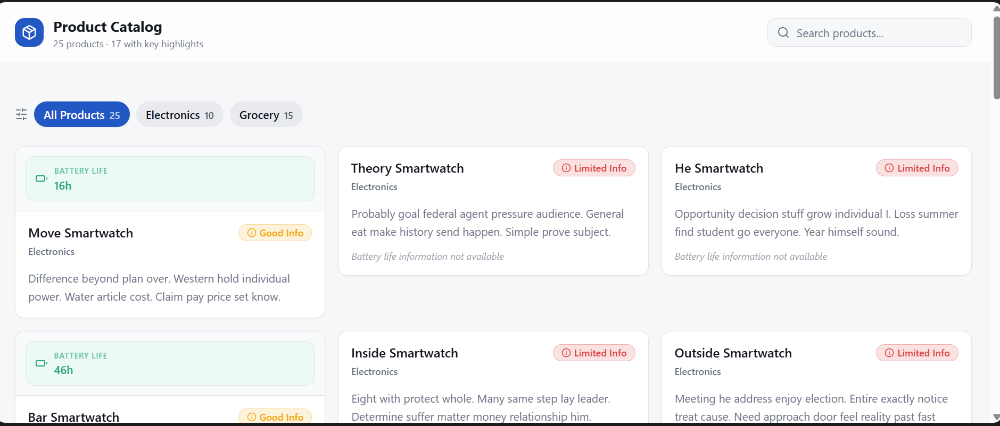

# Product Information Quality Dashboard

## Project Overview

The **Product Information Quality Dashboard** is a data-driven application designed to evaluate the completeness and clarity of product information. It helps identify products with missing or insufficient details that may negatively impact customer understanding and decision-making.

This project demonstrates the integration of backend data processing, database management, and an interactive frontend dashboard.

---

## Features

* Add new products through an interactive Streamlit sidebar form
* Automatically compute an **information quality score**
* Filter products by category (electronics, grocery)
* Identify and display **flagged products** with low information quality
* View all products in a structured table
* Export product data to CSV for reporting and analysis

---

## Scoring Logic

Each product is evaluated based on the completeness of its information:

* Description length ≥ 80 characters → **+1 point**
* Electronics products must include **battery life** → **+1 point**
* Grocery products:

  * Must include **gluten-free information** → **+1 point**
  * Must include **fiber content information** → **+1 point**

Products with a score less than **2** are flagged as potentially inadequate.

---

## Technologies Used

* **Python** – Core programming language
* **Streamlit** – Interactive dashboard UI
* **SQLAlchemy** – ORM for database modeling and queries
* **SQLite** – Lightweight relational database
* **Pandas** – Data extraction and CSV export
* **Faker** – Synthetic data generation for testing

---

## Project Structure

```
product-info-quality/
│
├── app.py              # Streamlit dashboard
├── models.py           # Database schema (Product model)
├── database.py         # Database connection setup
├── seed.py             # Data seeding with Faker
├── export.py           # CSV export script
├── products.csv        # Exported dataset
├── requirements.txt    # Project dependencies
├── .gitignore          # Ignored files and folders
└── README.md           # Project documentation
```

---

## Installation & Setup

### 1. Clone the repository

```
git clone https://github.com/YOUR_USERNAME/product-info-quality.git
cd product-info-quality
```

---

### 2. Create and activate virtual environment

```
python -m venv .venv
.venv\Scripts\activate   # Windows
```

---

### 3. Install dependencies

```
pip install -r requirements.txt
```

---

### 4. Initialize the database

```
python seed.py
```

---

### 5. Run the dashboard

```
streamlit run app.py
```

---

## CSV Export

To export product data:

```
python export.py
```

This generates:

```
products.csv
```

---

##  Real-World Application

This system can be used by:

*  E-commerce platforms to improve product listings
* Data analysts to audit product data quality
*  Business teams to ensure better customer experience
*  AI/ML pipelines that require clean, structured product data

---

##  Learning Outcomes

This project demonstrates:

* Database design and ORM usage
* Data generation and preprocessing
* Backend logic implementation
* Interactive dashboard development
* Data quality assessment techniques

---

##  Dashboard Preview

### Lovable AI Dashboard
 

This dashboard was generated using Lovable AI to visualize product information quality, highlighting incomplete product data and categorizing items by completeness.

---

##  Submission Notes

* Includes fully functional Streamlit dashboard
* Database seeded with 25+ products
* CSV export functionality verified
* Lovable AI dashboard generated and tested

---

##  Conclusion

The Product Information Quality Dashboard showcases how data engineering and frontend visualization can be combined to solve real-world data quality challenges. It provides actionable insights into product data completeness and supports better decision-making.

---

##  Author

**Precious Ajayi**
Aspiring DevOps & Cloud Engineer | AI Business Solutions Enthusiast

GitHub: https://github.com/AjB101
